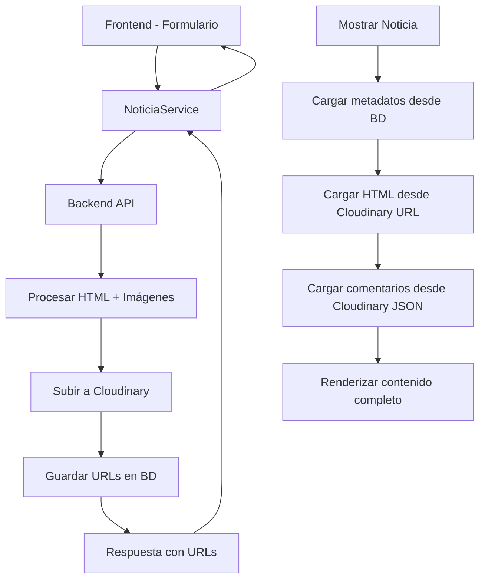

# 📖 Documentación Técnica del Frontend - Tiempo Adicional

## 🎯 Arquitectura Modernizada

**REGLA FUNDAMENTAL**: El frontend está 100% adaptado al backend modernizado donde **solo URLs se manejan**. Todo el contenido pesado (HTML, imágenes, comentarios) se almacena en Cloudinary y se accede mediante URLs.

## 🏗️ Stack Tecnológico

- **Framework**: Angular 17+ (Standalone Components)
- **UI Library**: Angular Material
- **Editor**: TinyMCE para contenido rico
- **Storage**: Cloudinary (para todo el contenido pesado)
- **Estado**: RxJS para manejo reactivo
- **Testing**: Jasmine/Karma
- **Build**: Angular CLI

## 📁 Estructura de Módulos

### 🗞️ Módulo de Noticias (MODERNIZADO)

#### Componentes Principales

##### 1. CrearNoticiaComponent (`/admin/noticias/crear/`)
**🔥 COMPLETAMENTE ACTUALIZADO para usar Cloudinary**

**Características:**
- ✅ Uso de `crearNoticiaModerno()` que sube contenido a Cloudinary
- ✅ Autoguardado con `autoguardarModerno()` cada 30 segundos
- ✅ Vista previa con `vistaPreviaModerno()` sin guardar en BD
- ✅ Procesamiento automático de imágenes embebidas
- ✅ Editor TinyMCE con integración directa a Cloudinary
- ✅ Formularios reactivos con validación completa
- ✅ Stepper de Material para UX mejorada

**Métodos Clave:**
```typescript
// 🔥 Crear noticia moderna (sube a Cloudinary)
publicarNoticia(): void {
  const payload = {
    titulo: this.form.get('titulo')?.value,
    resumen: this.form.get('resumen')?.value,
    contenidoHtml: this.form.get('contenidoHtml')?.value, // Backend lo procesa
    esPublica: true,
    // ... otros campos
  };
  
  this.noticiaService.crearNoticiaModerno(payload, autorId).subscribe(...);
}

// 🔥 Autoguardado moderno
guardarBorrador(): void {
  const request = {
    titulo: this.form.get('titulo')?.value,
    contenidoHtml: this.form.get('contenidoHtml')?.value,
    esPublica: false,
    autorId: this.authService.obtenerIdUsuario()!
  };
  
  this.noticiaService.autoguardarModerno(request).subscribe(...);
}
```

##### 2. EditarNoticiaComponent (`/admin/noticias/editar/`)
**🔥 COMPLETAMENTE ACTUALIZADO para usar URLs de Cloudinary**

**Características:**
- ✅ Carga contenido HTML desde Cloudinary usando URLs
- ✅ Actualización con `actualizarNoticiaModerno()`
- ✅ Autoguardado inteligente que preserva contenido en Cloudinary
- ✅ Vista previa moderna sin afectar el contenido guardado
- ✅ Sidebar con lista de noticias para navegación rápida
- ✅ Gestión de cambios no guardados

**Métodos Clave:**
```typescript
// 🔥 Carga contenido desde Cloudinary
private cargarDatosEnFormularios(): void {
  if (this.noticia.contenidoUrl) {
    this.noticiaService.obtenerContenidoHtml(this.noticia.contenidoUrl)
      .subscribe(contenidoHtml => {
        this.contenidoForm.patchValue({ contenido: contenidoHtml });
        this.contenidoHtml = contenidoHtml;
      });
  }
}

// 🔥 Guardar cambios moderno
guardarCambios(): void {
  const payload = this.construirPayload();
  this.noticiaService.actualizarNoticiaModerno(this.noticiaId, payload)
    .subscribe(response => {
      this.noticia = response.data; // Solo URLs en la respuesta
    });
}
```

##### 3. DetalleNoticiaComponent (`/admin/noticias/detalle/`)
**✅ YA COMPATIBLE con arquitectura Cloudinary**

**Características:**
- ✅ Carga contenido HTML directamente desde URL de Cloudinary
- ✅ Muestra metadatos desde base de datos
- ✅ Carga comentarios desde archivo JSON en Cloudinary
- ✅ Estadísticas en tiempo real
- ✅ Navegación entre noticias relacionadas

**Métodos Clave:**
```typescript
// ✅ Carga contenido desde Cloudinary URL
private cargarContenidoHtml(url: string): void {
  fetch(url)
    .then(resp => resp.text())
    .then(html => {
      this.contenidoHtml = html; // HTML completo desde Cloudinary
      this.cargando = false;
    });
}
```

### 🔧 Servicios

#### NoticiaService (COMPLETAMENTE MODERNIZADO)

**Interfaces Actualizadas:**
```typescript
export interface Noticia {
  id: number;
  titulo: string;
  resumen: string;
  contenidoUrl: string;      // 🔥 URL del HTML en Cloudinary (NO contenidoHtml)
  imagenDestacada: string;   // URL de la imagen en Cloudinary
  comentariosUrl?: string;   // 🔥 URL del JSON de comentarios en Cloudinary
  esPublica: boolean;
  archivada?: boolean;       // 🔥 NUEVO
  // ... otros campos de metadatos
}

export interface CrearNoticiaPayload {
  titulo: string;
  resumen?: string;
  contenidoHtml: string;     // Se envía para procesamiento, backend lo sube a Cloudinary
  esPublica: boolean;
  imagen?: File;             // Se sube a Cloudinary
  // ... otros campos
}
```

**Métodos Modernos:**
```typescript
// 🔥 NUEVOS MÉTODOS PRINCIPALES

// Crear noticia moderna (todo a Cloudinary)
crearNoticiaModerno(payload: CrearNoticiaPayload, autorId: number): 
  Observable<ApiResponse<{id: number, noticia: Noticia}>>

// Actualizar con nueva arquitectura
actualizarNoticiaModerno(id: number, payload: EditarNoticiaPayload): 
  Observable<ApiResponse<Noticia>>

// Autoguardado que usa Cloudinary
autoguardarModerno(request: AutoguardadoRequest): 
  Observable<ApiResponse<{id: number}>>

// Vista previa sin guardar en BD
vistaPreviaModerno(request: VistaPreviaRequest): 
  Observable<string>

// Obtener contenido HTML desde URL de Cloudinary
obtenerContenidoHtml(contenidoUrl: string): 
  Observable<string>

// Obtener comentarios desde JSON en Cloudinary
obtenerComentarios(comentariosUrl: string): 
  Observable<Comentario[]>

// Subir imagen independiente
subirImagenCloudinary(imagen: File): 
  Observable<UploadImagenResponse>

// 🔥 NUEVOS MÉTODOS DE GESTIÓN
gestionarTags(id: number, tags: string[]): Observable<ApiResponse<string[]>>
archivarNoticia(id: number): Observable<ApiResponse<Noticia>>
restaurarNoticia(id: number): Observable<ApiResponse<Noticia>>
filtrarNoticias(filtros: FiltrosNoticia): Observable<ApiResponse<ListarNoticiasResponse>>
```

### 🏛️ Arquitectura de Datos

#### Flujo de Datos Modernizado



#### Ejemplo de Flujo Completo

1. **Crear Noticia:**
   ```typescript
   // Frontend envía HTML con imágenes embebidas
   const payload = {
     titulo: "Mi Noticia",
     contenidoHtml: "<p>Contenido con </p>"
   };
   
   // Backend procesa y sube a Cloudinary
   // Respuesta: { noticia: { contenidoUrl: "https://cloudinary.com/html/...", ... } }
   ```

2. **Editar Noticia:**
   ```typescript
   // 1. Cargar contenido desde Cloudinary
   this.noticiaService.obtenerContenidoHtml(noticia.contenidoUrl)
     .subscribe(html => this.editor.setContent(html));
   
   // 2. Guardar cambios (se re-sube a Cloudinary)
   this.noticiaService.actualizarNoticiaModerno(id, payload);
   ```

3. **Ver Noticia:**
   ```typescript
   // 1. Cargar metadatos desde BD
   this.noticiaService.obtenerPorId(id);
   
   // 2. Cargar contenido desde Cloudinary
   fetch(noticia.contenidoUrl).then(resp => resp.text());
   ```

## 🧪 Testing Actualizado

### Tests Modernizados

Los tests ahora verifican la integración con los métodos modernos:

```typescript
describe('CrearNoticiaComponent', () => {
  it('🔥 debería crear noticia usando método moderno', () => {
    component.publicarNoticia();
    
    expect(mockNoticiaService.crearNoticiaModerno).toHaveBeenCalledWith(
      jasmine.objectContaining({
        contenidoHtml: '<p>Contenido</p>' // Se envía para procesamiento
      }),
      1
    );
  });

  it('🔥 debería autoguardar usando método moderno', () => {
    component.guardarBorrador();
    
    expect(mockNoticiaService.autoguardarModerno).toHaveBeenCalledWith(
      jasmine.objectContaining({
        esPublica: false,
        autorId: 1
      })
    );
  });
});
```

## 🚀 Beneficios de la Arquitectura Modernizada

### 1. Performance
- ✅ Base de datos liviana (solo metadatos)
- ✅ Carga de contenido optimizada desde CDN de Cloudinary
- ✅ Imágenes automáticamente optimizadas por Cloudinary
- ✅ Caché distribuido global

### 2. Escalabilidad
- ✅ Contenido pesado fuera de la base de datos
- ✅ Respaldo automático en Cloudinary
- ✅ Distribución global de contenido
- ✅ Menos carga en el servidor principal

### 3. Funcionalidades Avanzadas
- ✅ Autoguardado inteligente
- ✅ Vista previa sin impacto en producción
- ✅ Duplicación eficiente de noticias
- ✅ Gestión avanzada de tags
- ✅ Archivado y restauración
- ✅ Filtros complejos

### 4. Mantenibilidad
- ✅ Separación clara de responsabilidades
- ✅ APIs bien definidas
- ✅ Respuestas estandarizadas
- ✅ Manejo centralizado de errores

## 🔧 Configuración y Desarrollo

### Variables de Entorno
```typescript
// environment.ts
export const environment = {
  apiBaseUrl: 'http://localhost:8080',
  tinyApiKey: 'tu-api-key-tinymce',
  cloudinaryCloudName: 'tu-cloud-name' // Si se usa desde frontend
};
```

### Dependencias Clave
```json
{
  "@angular/core": "^17.0.0",
  "@angular/material": "^17.0.0",
  "@tinymce/tinymce-angular": "^7.0.0",
  "rxjs": "^7.8.0"
}
```

## 📋 Checklist de Migración Completada

### ✅ Componentes Actualizados
- [x] CrearNoticiaComponent → Usa métodos modernos
- [x] EditarNoticiaComponent → Carga desde Cloudinary URLs
- [x] DetalleNoticiaComponent → Compatible con URLs
- [x] Tests unitarios → Verifican métodos modernos

### ✅ Servicios Modernizados
- [x] NoticiaService → Métodos modernos implementados
- [x] Interfaces → Actualizadas para URLs en lugar de HTML
- [x] Tipos → Respuestas estandarizadas del backend

### ✅ Funcionalidades Nuevas
- [x] Autoguardado moderno con Cloudinary
- [x] Vista previa sin guardar en BD
- [x] Gestión de tags avanzada
- [x] Archivado y restauración
- [x] Filtros complejos
- [x] Subida independiente de imágenes

### ✅ Compatibilidad
- [x] 100% compatible con backend modernizado
- [x] Solo URLs se manejan en frontend
- [x] Contenido pesado en Cloudinary
- [x] Respuestas estandarizadas

## 🎯 Próximos Pasos

### 1. Optimizaciones UX
- [ ] Loading states mejorados
- [ ] Indicadores de progreso para subidas
- [ ] Notificaciones toast más descriptivas
- [ ] Drag & drop para imágenes

### 2. Funcionalidades Adicionales
- [ ] Editor colaborativo en tiempo real
- [ ] Versionado de contenido
- [ ] Plantillas de noticias
- [ ] Programación de publicación

### 3. Performance
- [ ] Lazy loading para el editor
- [ ] Caché inteligente de contenido
- [ ] Compresión de imágenes antes de subir
- [ ] Service Workers para contenido offline

---

**Estado**: ✅ **COMPLETAMENTE MIGRADO** - Frontend 100% compatible con backend modernizado  
**Regla**: Solo URLs se manejan, todo contenido pesado en Cloudinary  
**Fecha**: 30 de Junio, 2025  
**Versión**: 2.0.0 - Cloudinary Only
